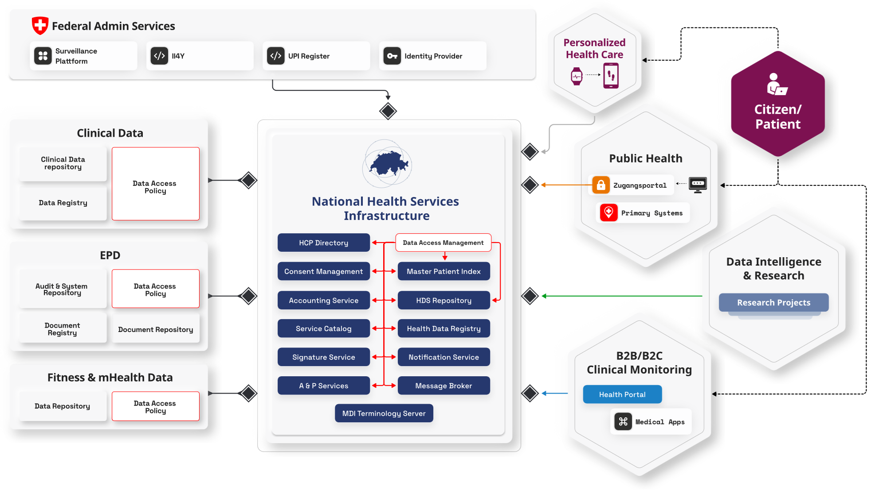
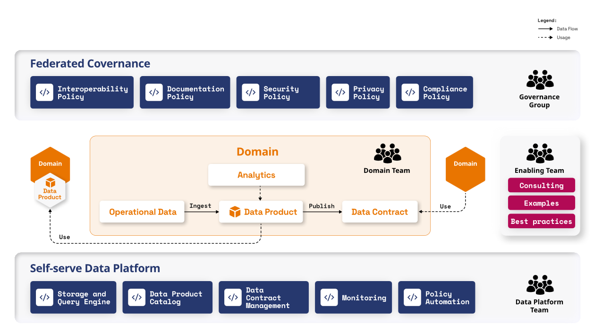
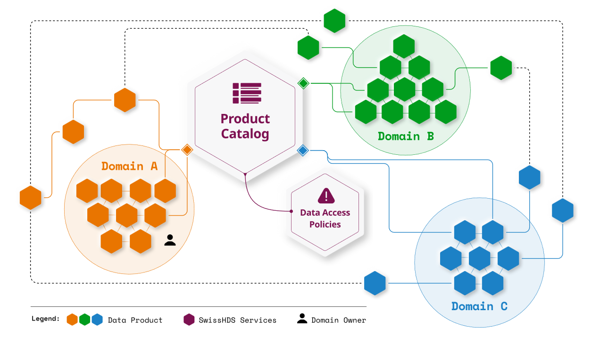
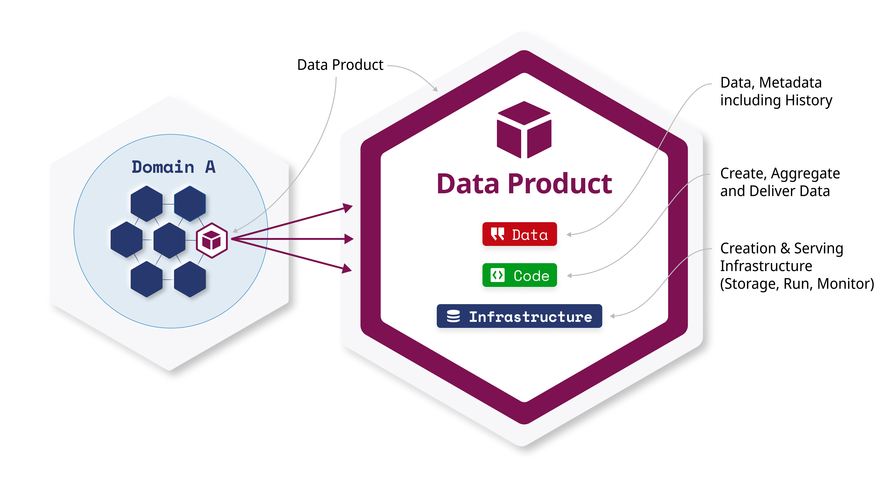
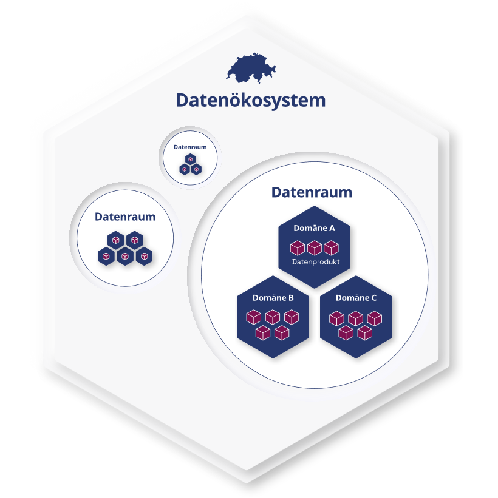
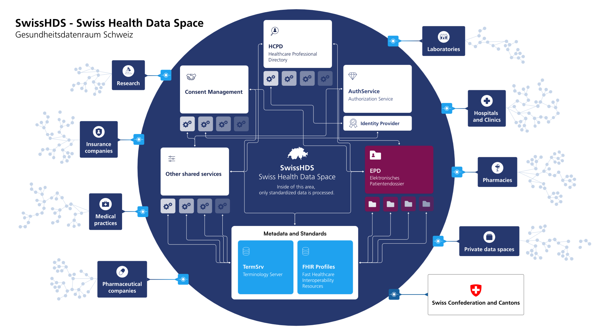

[Version française](README-FR.md) - [Versione italiana](README-IT.md)

# Glossar 

## Frage: Was ist ein Basisdienst?

**Basisservices** sind zentral bereitgestellte technische Komponenten,
die **grundlegende Funktionen für den Betrieb von SwissHDS** und den
fachlichen **Datenaustausch** bereitstellen. Sie basieren auf **keinem
eigenständigen Geschäftsmodell**, sondern werden zentral vom BAG
bereitgestellt und betrieben.

Basisdienste sind **fachdomänenunabhängig** und für alle Fachdienste
sowie Datenprodukte wiederverwendbar. Sie bilden die technische und
organisatorische Grundlage für **Interoperabilität, Sicherheit und
Vertrauen** im vernetzten Gesundheitsdatenraum.

### Beispiele

1.  Identity and Access Management
    1.  Authenticationservice/ Identity Provider (IdP)
    2.  Autorisation Service
    3.  Patient Participant Directory
    4.  Master Patient Index (MPI)
    5.  Healthcare Actors and Organisations Directory
    6.  Verzeichnisdienste Fachpersonen und Institutionen im Gesundheitswesen
2.  Data Access Management
    1.  Policy Repository - aus XACML Referenzarchitektur (Consent Store)
    2.  Policy Decision Service - aus XACML Referenzarchitektur
        (Consent-Entscheider, aka Consent-Management System)
    3.  Audit Log Service
    4.  Fraud Detection Service
3.  Support
    1.  Data Product Catalog
    2.  Notification Service
    3.  End-User Notification
    4.  Self-Service-Portal
    5.  Terminology-Server
    6.  Data Product Definition Editor
    7.  Anonymisation- oder Pseudonimisation-Service
4.  Convenience
    1.  Data Store as a Service
    2.  Convenience-Exchangeservice
    3.  Signatur- und Verifikationsservice

## Frage: Was ist Data Mesh?

Das Konzept Data Mesh wurde 2019 von Zhamak Dehghani eingeführt. Sie
definiert es als:

> *„A decentralized sociotechnical approach to share, access and manage
> analytical data in complex and large-scale environments -- within or
> across organizations."*

Im Zentrum steht der Wandel von zentralisierten Datenarchitekturen hin
zu einem dezentralen, domänenorientierten Ansatz: Daten werden dort
verantwortet, wo sie entstehen -- in den Fachdomänen. Statt Datensilos
oder zentraler Plattformen setzt Data Mesh auf vernetzte Datenprodukte
und klar geregelte Verantwortlichkeiten.

------------------------------------------------------------------------

### Die vier **Leitprinzipien** von Data Mesh

1.  **Domänenorientierte Datenverantwortung**\
    Fachbereiche (Fachdomänen) übernehmen die
    Verantwortung für ihre eigenen Daten. Sie sind zuständig für deren
    Bereitstellung, Qualität und Aktualität -- entsprechend ihrer
    Fachlogik und Nutzungskontexte.

2.  **Daten als Produkt**\
    Daten werden wie Produkte behandelt: mit klarem Nutzenversprechen,
    Zielgruppe, Qualitätssicherung, Versionierung und
    Benutzerfreundlichkeit. Ziel ist die Wiederverwendbarkeit und
    vertrauenswürdige Nutzung durch andere Akteure.

3.  **Selbstbedienungs-Dateninfrastruktur**\
    Eine zentrale, domänenübergreifende Plattform stellt die nötigen
    technischen Funktionen und Tools bereit (z.B. Authentisierung,
    Datenkataloge, Zugriffskontrolle), damit die
    Fachdomäne eigenständig und
    effizient mit Daten arbeiten können.

4.  **Föderierte Daten-Governance**\
    Standards, Richtlinien und Prinzipien werden gemeinsam über alle
    Domänen hinweg definiert und umgesetzt. Dabei bleiben die Domänen
    verantwortlich für die Einhaltung, während eine zentrale Governance
    Instanz Unterstützung, Harmonisierung und Kontrolle bietet.

------------------------------------------------------------------------

**Data Mesh im SwissHDS-Kontext** bedeutet:\
Die Datenbereitstellung im Schweizer Gesundheitswesen wird konsolidiert
und modernisiert -- mit Fokus auf nutzbare
Datenprodukte, vernetzte Infrastrukturen und klare Governance über alle
beteiligten Akteure hinweg. Der Bund stellt hierfür die nötigen
Strukturen, Regeln und technischen Services
(Basisdienste) bereit, um den
standardisierten und sicheren Datenaustausch zwischen
[Fachdomänen](https://confluence.edi.admin.ch/spaces/BAGSHDS/pages/326207421/Fachdom%C3%A4ne){rel="nofollow"}
zu ermöglichen.

Die Verantwortung für die Daten einer Fachdomäne liegt bei den
jeweiligen Fachdomänenteams, die auch für die fachliche Steuerung und
Qualitätssicherung zuständig sind. SwissHDS setzt auf das Prinzip der
Datenprodukte -- diese sollen, wo möglich und sinnvoll, auch innerhalb
von Fachdomänen konsequent genutzt und weitergegeben werden. Jedes
Datenprodukt muss in einer datenraumweiten Verzeichnis (\"Product
Catalog\") eingetragen sein, um Transparenz, Auffindbarkeit und
Wiederverwendbarkeit sicherzustellen.

## Frage: Was ist ein Data Product?

Der Begriff „Produkt" stammt aus dem Ansatz des „Produktdenkens", der in
den letzten Jahren Einzug in die Softwareentwicklung gehalten hat.
Zhamak Dehghani wandte den Begriff im zweiten Kernprinzip des **Data
Mesh an: „Daten als Produkt".** Das bedeutet, dass Software
-- oder mittlerweile auch Daten -- immer aus Sicht des Verbrauchers so
gestaltet wird, dass dieser die bestmögliche Benutzererfahrung erhält.
Genau wie ein physisches Produkt sollten diese konsequent für die
Bedürfnisse eines Verbrauchers entwickelt werden. Sie werden dem Kunden
auf verständliche Weise erklärt (intuitiv oder durch eine
Bedienungsanleitung), sie werden so optimiert, dass sie für den Benutzer
leicht zugänglich sind, und vielleicht auch beworben, um ihr Potenzial
aufzuzeigen. Und folglich haben sie möglicherweise auch einen Preis, den
die Verbraucher zu zahlen bereit sind. **Daten werden heute als
wertvoll** für das Unternehmen angesehen und sind nicht mehr nur ein
Nebenprodukt der Softwareentwicklung.

Der Begriff *Datenprodukt* leitet sich vom Prinzip *Daten als Produkt*
ab und folgt dessen Ideen, ist jedoch nicht synonym zu verstehen.

Ein Datenprodukt ist also etwas Technisches, das **von
Datenproduktentwicklern implementiert** wird. Es nutzt
Datentechnologien, um große Datensätze zu speichern und zu verarbeiten,
oft Millionen von Einträgen und mehr. Die Größe eines Datenprodukts ist
so konzipiert, dass es kohärente Domänenkonzepte oder Anwendungsfälle
abdeckt, die für sich genommen wertvoll sind. Die maximale Größe wird
durch den Umfang definiert, den ein Team bewältigen kann (s.a. Abb. 7).
Im Hinblick auf die Größe von Datenprodukten sind diese oft so
konzipiert, dass sie zusammenhängende Domain-Konzepte oder Use Cases
abdecken, die eigenständig sinnvoll und wertvoll sind. Die maximale
Größe wird i.d.R. durch den Umfang bestimmt, den ein Team bewältigen
kann -- so gesehen können Datenprodukte etwa mit Microservices oder
Self-Contained Systems verglichen werden.

Der Ansatz «Data as Product», beschrieben im zweiten Kernprinzip des
[Data Mesh](https://www.datamesh-architecture.com/) bedeutet, dass nicht nur Software sondern auch Daten
immer so gestaltet werden, dass aus Sicht des Verbrauchers der
grösstmögliche Nutzen entsteht. Der Ansatz rückt damit die Nutzbarkeit,
die Wiederverwendbarkeit und den Wert von Daten in den Mittelpunkt. Er
bildet die Grundlage für datengetriebene Innovation in einem föderierten
Datenökosystem wie dem **Swiss Health Data Space (SwissHDS)**.

Beispiele von Datenprodukte / Austauschformate:

- Medikationsliste / CH EMED -- eMedication Profile; definiert die
  Medikamente, die ein Patient einnimmt, abgeleitet aus dem *IHE
  Pharmacy Profil*
- Notfallpass / CH IPS -- nationale Version des *International Patient
  Summary*
- Zuweisung / CH eTOC -- *Transition of Care*, basierend auf *FHIR
  Questionnaires*

Somit umfasst in SwissHDS ein Datenprodukt - aus Sicht der
Datennutzung - eine Sammlung von gleichstrukturierten **Datenobjekten,**
die über den entsprechenden Output-Port im FHIR-Format oder via DICOM
Web bezogen (konsumiert) werden können (s.a. Abb. 7).

Ein **Data Product** (\"Datenprodukt") ist eine Datenquelle und eine
klar definierte, qualitätsgesicherte und dokumentierte Menge von
Datenelementen mit Mehrwert. Es wird innerhalb einer Fachdomäne so
bereitgestellt, dass es unmittelbar von anderen Domänen, Nutzenden oder
Systemen genutzt werden kann -- vergleichbar mit einem Softwareprodukt.

Der Ansatz, bekannt als **„Data as a Product"**, rückt die Nutzbarkeit,
Wiederverwendbarkeit und den Wert von Daten in den Mittelpunkt. Er
bildet die Grundlage für datengetriebene Innovation in einem föderierten
Datenökosystem wie dem **Swiss Health Data Space (SwissHDS)**.

**Datenprodukttyp** gibt einen Namen an den Daten innerhalb der
Datenprodukt. Beispiel von Datenprodukttyp ist Laboresultaten.

Jedes **Datenprodukttyp** muss in einer **datenraumweiten Registry**
eingetragen sein, um **Transparenz, Auffindbarkeit** und
**Interoperabilität** sicherzustellen.

Die Bereitstellung erfolgt **geregelt und nachvollziehbar** auf Basis
einer **Mesh-Topologie**, also als Teil
eines **vernetzten, domänenübergreifenden Datenraums**.

------------------------------------------------------------------------

### Merkmale eines Datenprodukts im SwissHDS

- **Interoperabilität & Standardisierung**\
  Das Datenprodukt verfügt über eine definierte Struktur und Semantik,
  basierend auf anerkannten Standards (z. B. FHIR), die eine
  maschinenlesbare Verarbeitung und systemübergreifende Integration
  ermöglichen.

- **Zugänglichkeit & Sicherheit**\
  Der Zugriff ist klar geregelt. Datenschutz und Informationssicherheit
  sind integrale Bestandteile der Bereitstellung.

- **Verantwortung & Governance**\
  Jedes Datenprodukt hat eine:n Data Product Owner, der/die für Wartung,
  Weiterentwicklung, Qualitätssicherung und Kommunikation verantwortlich
  ist.

- **Selbstbeschreibung & Auffindbarkeit**\
  Metadaten (z. B. Inhalt, Struktur, Herkunft, Aktualität) sind
  dokumentiert und über den SwissHDS-Datenkatalog zugänglich.

- **Wiederverwendbarkeit**\
  Der modulare Aufbau erlaubt die Mehrfachnutzung in verschiedenen
  Szenarien. Beschreibung und Schnittstellen sind so gestaltet, dass
  eine einfache Integration möglich ist.

- **Verlässlichkeit & Qualität**\
  Für jedes Datenprodukt gelten definierte Qualitätskriterien (z. B.
  Vollständigkeit, Plausibilität). Die Daten werden regelmässig
  validiert, versioniert und bei Bedarf weiterentwickelt.

------------------------------------------------------------------------

**Datenprodukte** sind der zentrale Baustein des **SwissHDS**. Sie
ermöglichen eine **nachhaltige, verantwortungsvolle und
wiederverwendbare Nutzung von Daten** -- sowohl innerhalb einzelner
Fachdomänen als auch **domänenübergreifend**.

### Konkretes Beispiel Labormeldungen

Soweit zur Theorie -- aber was bedeutet das **konkret**?

Im Folgenden wird ein **Beispielprozess** skizziert, der die
**Transformation vom dokumentenbasierten Meldewesen im Laborbericht**
hin zu einem **föderierten Data Mesh** zeigt.

Ziel dieses Gedankenexperiments ist es, dass **mehrere
Leistungserbringer** ihre Labormeldungen als **strukturierte,
interoperable Datenprodukte** bereitstellen, die über **gemeinsame
Standards** (z. B. HL7 FHIR) und **Terminologien** (z. B. SNOMED CT,
LOINC, ICD-10) **harmonisiert** sind.

### Ausgangslage: Dokumentenbasierte Meldung

Laborresultate werden derzeit häufig als **PDF, HL7v2 oder Fax** an
Gesundheitsbehörden oder andere Stellen übermittelt (z. B. im Rahmen von
Meldepflichten). Die Inhalte sind meist **semistrukturiert oder
unstrukturiert** und lassen sich kaum automatisiert weiterverarbeiten.

Es existiert **kein einheitliches Format** und keine **zentral nutzbare
Semantik**, wodurch die **Weiternutzung der Daten** -- etwa für
Forschungszwecke -- nur mit erheblichem manuellem Aufwand möglich ist.
Häufig sind zusätzliche **Erfassungs- oder Kuratierungsprozesse** nötig,
um die Daten nutzbar zu machen.

### Zielbild: Föderiertes Datenprodukt „Laborresultate"

Jedes Labor bzw. jeder Leistungserbringer stellt seine Laborresultate
als **FHIR-basierte Datenprodukte** in einem eigenen **Product Store**
bereit.

Die Daten sind **semantisch annotiert**, z. B.:

- **LOINC** für Tests

- **SNOMED CT** für qualitative Ergebnisse

- **ICD-10** für Diagnosen

Die Datenprodukte sind **auffindbar, versioniert** und **zugreifbar**
über **Registry und Zugriffskontrolle**.

Dies ermöglicht eine breite **Nutzung**: in **Primärsystemen**, für
**Sekundärnutzung**, **Public Health** und **Forschung**.

### Prozessschritte im Detail

**1. Definition & Modellierung**

Das **Core Data Model „Laborresultate"** wird gemeinsam in der zentralen
**SwissHDS-Governance** definiert. Die aus der **Business-Analyse**
abgeleiteten **Geschäftsobjekte** werden in **Datenobjekte** überführt
und in den **FHIR-Ressourcen** Observation, DiagnosticReport, Patient
und Specimen abgebildet.

Die **erlaubten Werte** für die Attribute einer FHIR-Ressource (**Value
Sets**) sind an medizinische Terminologien gebunden, beispielsweise:

- - **LOINC** für Laborverfahren und Testcodes

- **SNOMED CT** für Ergebnisse

- **UCUM** für Einheiten

- **ICD** für den Diagnosekontext

**2. Erstellung einer Datenproduktbeschreibung**

Für jedes zu erstellende Datenprodukt werden **Metadaten**,
**Zugriffsrechte**, **Aktualisierungsfrequenz**, **Gültigkeitsdauer**
und weitere relevante Eigenschaften **detailliert beschrieben**.

**3. Technische Umsetzung bei Leistungserbringern**

Jedes Labor implementiert das **Datenprodukt lokal**. Dazu müssen die
Daten aus den Systemen (z. B. Laborinformationssystem, LIS) in die
**vorgegebene Struktur transformiert** werden. Gleichzeitig müssen die
**lokalen Value Sets** auf die **vorgesehenen Value Sets** abgebildet
werden, um ein **FHIR-kompatibles Datenprodukt** zu erzeugen.

Perspektivisch soll in Zusammenarbeit mit den **Systemherstellern**
erreicht werden, dass diese **Transformations- und Mappingprozesse**
künftig entweder **entfallen** oder direkt im **Quellsystem**
durchgeführt werden.

Die erstellten Inhalte können anschließend gegen definierte **Profile
des FHIR-Terminologieservers des BAG** validiert werden.

**4. Anbindung an föderierte Dateninfrastruktur**

Die bereitgestellten **Datenprodukte** bzw. die **Endpunkte der FHIR
APIs** werden im **SwissHDS Data Catalog / Registry** registriert. Dabei
werden folgende Informationen hinterlegt:

- **Beschreibung** des Datenprodukts

- **Schema** und Struktur der Daten

- **Bereitstellungsformat**

- **Fachdomäne**

- **Zugriffsmöglichkeiten**

- **API-Endpunkte**

Diese Registrierung stellt sicher, dass die Datenprodukte **auffindbar,
interoperabel und nutzbar** innerhalb des föderierten Datenraums sind.

**5. Zugriff auf Datenprodukte**

Der Zugriff auf die Datenprodukte erfolgt über eine **föderierte Suche**
im vom BAG bereitgestellten **Self-Service-Portal**. Nutzer:innen können
**Metadatenfilter** verwenden, z. B. um alle „PCR-Resultate" für
bestimmte Pathogene zu finden.

**Berechtigte Akteure** erhalten den Zugriff automatisiert über
**Zugriffsanfragen**, die durch ein **Policy Framework** und etablierte
**Zugriffskontrollmechanismen** gesteuert werden.

Die **Datenbereitstellung** kann auf verschiedene Arten erfolgen:

- **Direkte Abfrage** über FHIR APIs (z. B. `Observation?code=...`)

- **Regelmäßiges Abonnement / Push-Mechanismus**

Für analytische Zwecke genügt oft die einmalige Abfrage zum Zeitpunkt
der Analyse. Andere Use Cases erfordern **aktive Benachrichtigungen**,
sobald neue Daten verfügbar sind.

Bei jeder Abfrage kann zudem ein **Abgleich mit dem zentralen
Einwilligungsmanagement** durchgeführt werden, um sicherzustellen, dass
die Nutzung datenschutzkonform erfolgt.

**6. Qualitätssicherung & Governance**

Im **Data Mesh** ist eine regelmäßige **Validierung der Datenqualität**
verpflichtend. Dies umfasst insbesondere:

- **Vollständigkeit** der Daten

- **Konsistenz** innerhalb und zwischen Datensätzen

- **Semantische Korrektheit**

Zudem wird ein **durchgängiges Monitoring von Änderungen** durchgeführt,
z. B. über **Versionierung** und **Deaktivierung** von Datenprodukten.

Ein zentraler Vorteil: Diese Aufwände fallen **nicht mehr pro Datensatz
oder Anwendungsfall** an, sondern **nur noch pro Datenprodukt**. Die
**Verantwortung** für die Qualitätssicherung liegt beim
**Datenprodukt-Owner im Labor**.

## Frage: Was ist das Datenökosystem Schweiz

> Unter einem **Datenökosystem** versteht man eine dezentrale
> Koordinationsform zwischen Organisationen und Individuen, die ein
> gemeinsames Ziel verfolgen, sei es der Datenaustausch oder die
> Bereitstellung von Produkten oder Dienstleistungen, wobei
> komplementäre Fähigkeiten und Kompetenzen insgesamt verstärkend
> wirken. Nutzen: hohe Interoperabilität. Besonders für kleine und
> mittelständische Unternehmen bietet ein Datenökosystem die Chance,
> schnell und einfach auf geteilte Ressourcen (z.B. leistungsstarke
> Infrastrukturen oder KI-Dienstleistungen) zuzugreifen und Daten mit
> Kooperationspartnern zu verknüpfen, um die notwendige Datenmenge für
> datengetriebene Analysen zu generieren.                   
>  *Quelle: [Was bringen Datenökosysteme wie GAIA-X für den Mittelstand?
> -- Fraunhofer IAO --
> BLOG](https://blog.iao.fraunhofer.de/was-bringen-datenoekosysteme-wie-gaia-x-fuer-den-mittelstand/)*

Die **Gesamtheit aller vertrauenswürdigen und kompatiblen Datenräume**
bildet das **Datenökosystem Schweiz**.

Die **Anlaufstelle Datenökosystem Schweiz** (Bundeskanzlei) unterstützt
**Aufbau, Harmonisierung** und **internationale Anschlussfähigkeit** der
Datenräume und fördert den **Austausch über Communities of Practice**.

Durch **verbindliche Governance-Vorgaben, Standards** und
**Architekturgrundlagen** wird sichergestellt, dass:

- Datenräume **interoperabel** (technisch, semantisch und
  organisatorisch) sind.

- **Vertrauen und Sicherheit** gewährleistet sind.

- **Skalierbarkeit** durch modulare Bausteine möglich ist.

Das **[Datenökosystem
Schweiz](https://www.bk.admin.ch/bk/de/home/digitale-transformation-ikt-lenkung/datenoekosystem_schweiz.html)** verfolgt das Ziel, die **Mehrfachnutzung von Daten**
durch Akteure aus **Wirtschaft, Wissenschaft, Verwaltung und
Öffentlichkeit** in einem **vertrauenswürdigen Rahmen** zu ermöglichen.

Im Fokus stehen dabei:

- **Interoperable Datenräume**, in denen Daten **über Organisations- und
  Sektorengrenzen hinweg** geteilt und genutzt werden können,

- **Gemeinsame Grundsätze**, die **rechtliche, organisatorische,
  semantische und technische Aspekte** verbinden,

- **Skalierbarkeit**, damit mehrere Datenräume **integriert** und zu
  einem **föderierten Ökosystem** verbunden werden können.

## Frage: Was ist ein Datenraum?
Ein **Datenraum** ist ein **vertrauenswürdiges digitales Ökosystem**, in
dem **Organisationen, Fachbereiche und Systeme** Daten **nach klar
definierten Prinzipien teilen, nutzen und gemeinsam weiterentwickeln**
können -- unter Wahrung von Datenschutz, Governance und
Interoperabilitätsstandards.

------------------------------------------------------------------------

### Wesentliche Merkmale eines Datenraums:

Ein Datenraum zeichnet sich durch mehrere zentrale Merkmale aus:

- **Vertrauensrahmen:** Gemeinsame Prinzipien für **Datenschutz,
  Sicherheit** und **Governance**

- **Interoperabilität:** Nutzung **einheitlicher Datenformate,
  Standards** (z. B. FHIR) und **Terminologien**

- **Technische Basisdienste:** Bereitstellung von Diensten wie
  **Authentisierung, Autorisierung, Logging** und **Consent Management**

- **Föderiertes Modell:** Die Daten verbleiben bei den
  **Ursprungsorganisationen**, werden jedoch **standardisiert zugänglich
  gemacht**

- **Datenprodukte:** Geteilte Daten sind **strukturiert,
  qualitätsgesichert, dokumentiert** und **wiederverwendbar**

------------------------------------------------------------------------

### Beispiele für Datenräume im Datenöksystem Schweiz:

- Der Swiss Health Data Space (SwissHDS) als sektorenübergreifender
  Datenraum für das Schweizer Gesundheitswesen

- Datenraum MODI: [Behörde, Energie, Gebäude und Grundstücke,
  Geoinformationen, Infrastruktur, Mobilität, Öffentliche Statistik,
  Sicherheit, Umwelt,
  Unternehmen]

- [agridata.ch: Landwirtschaft, Tiere,
  Umwelt]

- [komplette Auflistung unter: [Monitoring Datenräume
  Schweiz](https://www.bk.admin.ch/bk/de/home/digitale-transformation-ikt-lenkung/datenoekosystem_schweiz/monitoring-datenraume.html)

------------------------------------------------------------------------

Ein **Datenraum** schafft die Voraussetzungen dafür, dass Daten nicht
nur **sicher**, sondern auch **wirksam und nachhaltig** genutzt werden
können -- sei es für **Versorgung, Forschung, Planung** oder
**Innovation**.

### Bausteine

Die **Bundeskanzlei** orientiert sich am **Data Spaces Support Center
(DSSC)-Modell** der EU und definiert **17 modulare Bausteine**, die
Datenräume **konsistent, interoperabel und skalierbar** machen
([bk.admin.ch](http://bk.admin.ch)).

Diese Bausteine lassen sich in **zwei Kategorien** gliedern:

#### 1. **Geschäfts- und Organisationsbausteine**

- Gouvernanz: Rahmensetzung für Beteiligte, Rollen, Verantwortlichkeiten

- Geschäftsbetrieb & Modelle: Gebührenmodelle, Finanzierung,
  Nachhaltigkeit

- Anwendungsfälle & Datenprodukte: Definition der Nutzungsszenarien und
  Services

- Rechtlicher Rahmen: Datenschutz, Verträge, Compliance

- Teilnehmenden-Management: Onboarding, Rechteverwaltung

#### 2. **Technische Bausteine**

- Interoperabilität: Datenmodelle, semantische Standards,
  Austauschformate

- Identitätsmanagement: Authentisierung, Autorisierung

- Datenkataloge & Metadatenverzeichnis

- Consent und Datenschutz-Infrastruktur

- Protokollierung & Auditing

- Infrastrukturkomponenten: Speicherdienste, Pseudonymisierung,
  Signatur, Benachrichtigungen

Jeder Datenraum -- wie etwa **SwissHDS** im Gesundheitswesen -- nutzt je
nach Bedarf eine **Auswahl dieser Bausteine**. Die Bausteine sind
**modular realisierbar, interoperabel** und **kompatibel mit anderen
Datenräumen**, wodurch der Aufbau neuer Dienste erleichtert wird.

Die **Anlaufstelle Datenökosystem Schweiz** unterstützt dies durch die
Bereitstellung von **Grundlagen, Prototypen** und die Förderung von
**Community-Bildung**.

## Frage: Was ist ein Fachdienst?

Ein **Fachdienst** ist ein Dienst für den **Datenaustausch und die
Datennutzung** innerhalb eines klar abgegrenzten fachlichen Kontexts
(**Fachdomäne**). Er unterstützt **Anforderungen mehrerer Usecases**,
indem er die **technischen und organisatorischen Rahmenbedingungen und
Voraussetzungen für eine effiziente Datennutzung** bereitstellt.

Ein Fachdienst gewährleistet somit die **nachhaltige Nutzbarkeit,
Interoperabilität und Sicherheit von Gesundheitsdaten** -- sowohl
**innerhalb einer Domäne (Primärnutzung), als auch domänenübergreifend**
im SwissHDS (Bereitstellung von Datenprodukten für Sekundärnutzungen
z.B. in den Bereichen Forschung, Qualitätsicherung, Statistik, etc).

### **Merkmale**

- Unterstützt **mehrere Usecases** innerhalb einer Fachdomäne

- Basiert auf **standardisierten Schnittstellen und
  Interoperabilitätsvorgaben** (z. B. FHIR, SNOMED CT, LOINC, ICD)

- Enthält **prozessuale Vorgaben, ein Rollenmodell, eine
  Governance-Logik** sowie **technische Spezifikationen**

- Stellt **wiederverwendbare Bausteine** für datenbasierte
  Fachanwendungen bereit

- **Fachliche Anforderungen** (z. B. aus Usecases) bestimmen den Bedarf
  an einem Fachdienst -- nicht umgekehrt

- Eine Domäne kann einen Fachdienst nur nutzen, wenn sie dessen
  **Spezifikationen technisch und organisatorisch umsetzen** kann

### **Beziehung zu anderen Begriffen**

- **Usecases** bilden den Ausgangspunkt für die Spezifikation eines
  Fachdienstes. Mehrere verwandte Usecases können durch denselben
  Fachdienst unterstützt werden.

- Ein Fachdienst ist **nicht identisch mit einem Usecase**, sondern
  stellt die gemeinsame **fachlich-technische Grundlage** für dessen
  Realisierung bereit.

- Fachdienste **nutzen Datenprodukte** oder ermöglichen deren
  Bereitstellung und Austausch.

- Sie sind Teil der **SwissHDS-Zielarchitektur** und bilden zentrale
  **Bausteine im Datenökosystem Gesundheit**.

### **Beispiel: Fachdienst eMedikation**

Der Fachdienst „eMedikation" definiert Prozesse, Rollen und
Schnittstellen für den standardisierten Austausch und die Nutzung von
Medikationsdaten über Leistungserbringer hinweg. Unterstützte Usecases
sind u. a.:

- *Rezept erstellen*

- *Medikationsplan konsultieren*

- *Medikationsplan anpassen*

- *Medikationsdaten im EPD einsehen*

- *Medikationsdaten auswerten*

In **Fachdienst** legt unter anderem fest:

- **Zugriffsberechtigte Akteure:** Wer auf die Daten zugreifen darf
  (z. B. Ärztin, Apotheker, Patient)

- **Datenformat:** In welchem Format die Daten übermittelt werden (z. B.
  FHIR `MedicationStatement`)

- **Zugriffsregelungen:** Wie der Zugriff gesteuert wird (z. B. über
  Consent-Management)

- **Terminologien:** Welche standardisierten Terminologien verwendet
  werden (z. B. ATC-Codes, SNOMED CT)

### **Zusammenfassung**

Ein **Fachdienst** ist ein zentraler **struktureller Baustein** des
SwissHDS. Er sorgt für die notwendige **Standardisierung und
Governance**, um **datenbasierte Fachprozesse** skalierbar, sicher und
interoperabel zu unterstützen.

## Frage: Was ist eine Fachdomäne?

Eine **Fachdomäne** bezeichnet einen klar abgegrenzten **inhaltlichen
Verantwortungsbereich** innerhalb des Gesundheitswesens, in dem
**spezifisches Wissen, Daten und Prozesse** zusammengehören. Sie bildet
die **organisatorische und fachliche Grundlage** für die Entwicklung,
Bereitstellung und Nutzung von **Datenprodukten** im SwissHDS.

Beispiele für Fachdomänen:

- Notfallversorgung

- eMedikation

- Infektionskrankheiten

- Onkologie

- Pflege

- Spitalplanung

Im **Data Mesh-Ansatz** ist jede Fachdomäne **verantwortlich für ihre
eigenen Daten** -- von der **Modellierung über die Qualitätssicherung**
bis hin zur **kontrollierten Bereitstellung** für andere Akteure.

------------------------------------------------------------------------

### Merkmale einer Fachdomäne im SwissHDS

- **Fachliche Zuständigkeit** für bestimmte Datentypen und Datenprodukte

- **Domänenverantwortliche** koordinieren Aufbau, Weiterentwicklung und
  Betrieb der Datenprodukte

- **Zusammenarbeit** mit technischen, rechtlichen und
  governancebezogenen Querschnittsfunktionen

- **Integration** in ein föderiertes Datenökosystem, in dem Daten über
  klar definierte Schnittstellen geteilt werden

------------------------------------------------------------------------

Fachdomänen strukturieren das SwissHDS entlang **fachlicher Linien**,
ermöglichen eine **dezentrale, aber koordinierte Datenverantwortung**
und bilden das **Rückgrat des Data-Mesh-Ansatzes**.

## Frage: Was ist der Gesundheitsdatenraum SwissHDS?

**Der SwissHDS]** (auch bezeichnet als „Datenraum Gesundheit" oder
„Gesundheitsdatenraum") ist ein
Projekt des DigiSanté-Programms mit dem Ziel, einen **vertrauenswürdigen,
interoperablen Gesundheitsdatenraum** aufzubauen. Er ermöglicht die
**medienbruchfreie, standardisierte und
sichere Verknüpfung von Gesundheitsdaten** über Institutionen, Rollen
und Use Cases hinweg -- von der **Behandlung bis zur
Forschung**.

Dies wird durch eine Kombination aus
**Basisdiensten** (z. B. Authentisierungs-
oder Autorisierungsdienste) und
**Fachdiensten** erreicht, die den
**Datenaustausch und die Datennutzung** innerhalb klar definierter
Fachdomäne unterstützen, wie etwa
**eMedikation** oder **Notfallversorgung**.

Der SwissHDS folgt den Prinzipien eines **föderierten
Datenraums**: Die Daten verbleiben bei den
**ursprünglichen Einrichtungen**, werden aber über **gemeinsame
Standards, Schnittstellen und Governance-Mechanismen** als
**qualitätsgesicherte Datenprodukte** zugänglich gemacht -- basierend
auf den Konzepten **Data Mesh** & **Data
Product**.

Dies bildet die Grundlage für ein **modernes, datenzentriertes
Gesundheitssystem** und unterstützt gleichzeitig **Datenschutz,
Datenhoheit** sowie eine **zweckgebundene Nutzung** der
Gesundheitsdaten.

## Frage: Was ist ein Sream?

Ein **Stream** ist ein organisatorisches Strukturelement innerhalb des
Projekts **Swiss Health Data Space (SwissHDS;** vgl.
Projektorganisation)
und dient der **thematischen Bündelung und Koordination mehrerer
Themengruppen**, die an verwandten Aufgaben und Fragestellungen
arbeiten.

Jeder Stream wird von einem **Stream Owner** geleitet. Die Hauptaufgaben
des Stream Owners sind:

- **Abstimmung und Verwaltung der Epics** (übergreifende Aufgabenpakete)
  in enger Zusammenarbeit mit den Leads der jeweiligen Themengruppen,

- **Koordination und Priorisierung der Themen** innerhalb des Streams,

- sowie die **regelmäßige Berichterstattung an die Projektleitung**,
  insbesondere zum Status, identifizierten Risiken, getroffenen oder
  geplanten Maßnahmen und möglichen Abweichungen.

Streams schaffen **Struktur, Transparenz und Effizienz** bei der
Umsetzung der Projektziele, indem sie die Zusammenarbeit thematisch
verwandter Gruppen bündeln und eine klare Verantwortlichkeit etablieren.

## Frage: Was ist eine Themengruppe?

Eine **Themengruppe** ist ein organisatorisches Element innerhalb des
Projekts **SwissHDS** (vgl.
Projektorganisation)
und dient der **strukturierten Bearbeitung spezifischer Themenfelder**
innerhalb eines Streams.

Jede Themengruppe ist einem **Stream zugeordnet** und verfügt über
eine:n **Lead**, der die operative Verantwortung für die Umsetzung der
vom **Stream Owner** definierten **Epics** trägt. Der Lead koordiniert
die **Zerlegung dieser Epics** in **Features** und **User Stories**, in
enger Abstimmung mit dem Stream Owner und gemeinsam mit den Mitgliedern
der agilen Umsetzungsteams.

Zudem ist der Lead der Themengruppe für das **regelmäßige Reporting** an
den Stream Owner verantwortlich. Dies umfasst insbesondere:

- den aktuellen **Umsetzungsstatus**,

- **identifizierte Risiken und Herausforderungen**,

- sowie **vorgeschlagene oder umgesetzte Maßnahmen**.

Themengruppen ermöglichen so eine **fokussierte, kollaborative und agile
Bearbeitung** von fachlich oder technisch abgegrenzten Teilbereichen
innerhalb eines Streams.

## Frage: Was ist ein Use Case?

Ein **Usecase (Anwendungsfall)** beschreibt einen konkreten fachlichen
Bedarf oder ein Problem, das innerhalb des **SwissHDS** (Swiss Health
Data Space) durch den Einsatz von Daten und IT-gestützten Prozessen
gelöst werden soll. Usecases werden aus Sicht der **Nutzer:innen**
formuliert und dienen als Ausgangspunkt für die Definition von
**Fachdiensten, Datenprodukten** und **technischen Anforderungen**.

### Merkmale von Usecases

Ein Usecase beantwortet die Frage:

> „Was soll mit welchen Daten durch wen erreicht werden?"

- **Kontextbezogen:** Meist entlang von Versorgungssituationen,
  Fachprozessen oder gesetzlichen Anforderungen.

- **Bestandteile:**

    - Ein klar abgegrenztes **Ziel oder Ergebnis**

    - Die beteiligten **Rollen/Akteure**

    - Eine grobe **Beschreibung des Prozessablaufs**

    - Die betroffenen **Datenobjekte**

### Beziehung zu anderen Begriffen

- Mehrere Usecases einer **Fachdomäne** können die Notwendigkeit für
  einen **Fachdienst** ableiten, der die **Wiederverwendung
  standardisiert**.

- Usecases sind **nicht identisch mit Fachdiensten**, sondern bilden die
  Basis für deren Konzeption.

- Ein Fachdienst kann mehrere Usecases unterstützen, sofern sie in
  derselben Domäne liegen und ähnliche **technische und organisatorische
  Anforderungen** teilen.

- Die Umsetzung eines Usecases kann **mehrere Datenprodukte** erfordern,
  die **interoperabel über SwissHDS** bereitgestellt werden.

### Beispiele für Usecases in der Domäne **eMedikation**

- **Rezept erstellen:** Eine Ärztin verschreibt ein Medikament
  elektronisch.

- **Medikationsplan konsultieren:** Ein Apotheker oder Patient ruft die
  aktuelle Medikation ab.

- **Medikationsdaten im EPD einsehen:** Eine Spitalärztin konsultiert
  historische Medikation im elektronischen Patientendossier.

- **Medikationsdaten auswerten:** Ein Versorgungsmonitoring analysiert
  anonymisierte Daten zur Medikation bei chronisch Kranken.

### Hinweise zur Formulierung

Usecases werden im SwissHDS typischerweise **kurz und
aktionsorientiert** beschrieben, in der Form **Subjekt + Verb +
Objekt**.\
Beispiele: „Patient konsultiert Medikationsplan", „Apotheker passt
Rezept an".
